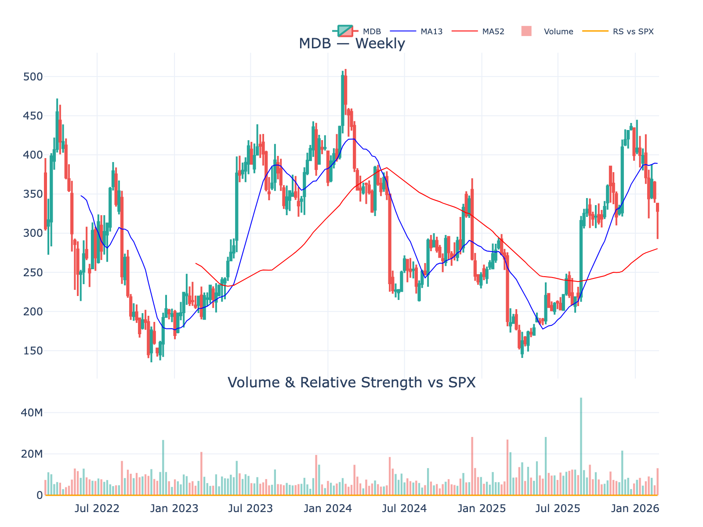
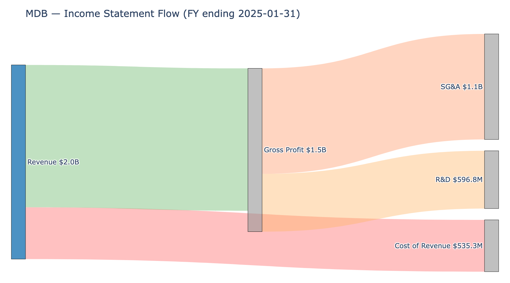

# MongoDB, Inc. -- 2026-02-28T16:23:19

**Symbol:** MDB
**Sector:** Technology | **Industry:** Software - Infrastructure
**Current Price:** $328.47
**Market Cap:** $26.7B

---

## Stock Chart

*4-year weekly chart showing price action, 13-week and 52-week moving averages, volume, and relative strength vs S&P 500*

---

## Technical Analysis Summary

**Current Price:** $328.4700012207031

| Indicator | Value | Signal |
|-----------|-------|--------|
| **20-Day SMA** | $346.95 | ❌ Bearish |
| **50-Day SMA** | $386.85 | ❌ Bearish |
| **200-Day SMA** | $304.97 | ✅ Bullish |
| **RSI (14)** | 41.65 | Neutral |
| **MACD** | -16.63 | ❌ Bearish |

**Volatility:** ATR = $23.01
**Volume:** 1,778,015 (20-day avg)

**Trend Status:**

- Long-term trend: ✅ **Bullish** (above 200-day SMA)

- Golden Cross: ✅ **Active** (50-day SMA above 200-day SMA)

---

## Peer Comparison

| Symbol | Name | Price | Market Cap | P/E | Revenue | Margin | ROE |
|--------|------|-------|------------|-----|---------|--------|-----|
| **MDB** | **MongoDB, Inc.** | **$328.47** | **$26.7B** | **N/A** | **$2.3B** | **-3.06%** | **-3.23%** |
| SNOW | Snowflake Inc. | $168.41 | $57.6B | N/A | $4.7B | -28.43% | -53.91% |
| DDOG | Datadog, Inc. | $111.96 | $39.5B | 361.16 | $3.4B | 3.14% | 3.34% |
| ESTC | Elastic N.V. | $52.07 | $5.5B | N/A | $1.7B | -5.04% | -10.24% |
| CFLT | Confluent, Inc. | $30.67 | $11.0B | N/A | $1.2B | -25.31% | -27.72% |
| DT | Dynatrace, Inc. | $35.92 | $10.8B | 59.87 | $1.9B | 9.55% | 6.96% |

*Metrics: P/E (Trailing), Revenue (TTM in billions), Net Profit Margin, Return on Equity*

### Income Statement Flow

*Sankey diagram showing revenue flow through cost of revenue, operating expenses, taxes to net income*

---

## Comprehensive Deep Research Analysis

## Company Overview

### History

MongoDB, Inc. (NASDAQ: MDB) traces its origins to 2007, when Dwight Merriman, Eliot Horowitz, and Kevin Ryan — all veterans of the advertising technology company DoubleClick — founded a startup called 10gen in New York City. The company initially set out to build a platform-as-a-service (PaaS) product, but in 2009 the founders pivoted to focus exclusively on the MongoDB database after recognizing its potential to address internet-scale data challenges that legacy relational systems could not handle. The database was open-sourced that same year, and 10gen began offering commercial support alongside the free product.

The pivot proved decisive. MongoDB's document-oriented data model — which stores data in flexible, JSON-like structures rather than rigid relational tables — resonated with developers building modern web and mobile applications. By 2013, the company had gained enough traction to rebrand from 10gen to MongoDB, Inc., aligning its corporate identity with its flagship product.

Key milestones followed in quick succession. In June 2016, MongoDB launched Atlas, a fully managed cloud database-as-a-service (DBaaS), marking its strategic shift toward cloud-delivered revenue. The IPO came on October 20, 2017, when MongoDB listed on NASDAQ at $24 per share, raising $192 million. In 2018, the company released MongoDB 4.0 with multi-document ACID transaction support, addressing a longstanding limitation of NoSQL databases and broadening the platform's applicability to enterprise workloads. That same year, MongoDB changed its licensing from the GNU Affero General Public License (AGPL) to the Server Side Public License (SSPL), a move designed to prevent hyperscale cloud providers from offering MongoDB as a service without contributing back to the project.

Dev Ittycheria joined as CEO in 2014 and led the company for 11 years, overseeing its transformation from a roughly $40 million revenue business to nearly $2 billion. Under his tenure, Atlas grew from a new product to the company's dominant revenue driver. In November 2025, Ittycheria stepped down and was succeeded by Chirantan "CJ" Desai. Ittycheria remains on the board and serves as an advisor through November 2026.

### Core Business

MongoDB operates a developer data platform anchored by its document-oriented database. The platform serves as a general-purpose alternative to traditional relational databases and competing NoSQL systems. As of February 2026, the company employed approximately 5,639 people; as of the fiscal year ended January 31, 2025, it had 5,558 employees and over 54,500 customers spanning more than 100 countries worldwide.

Revenue for fiscal year 2025 (ended January 31, 2025) totaled $2.01 billion, up 19% year-over-year. The business breaks into three components (figures approximate, may not sum to 100% due to rounding):

- **MongoDB Atlas** (70% of FY2025 revenue): A fully managed, multi-cloud DBaaS available across AWS, Google Cloud Platform, and Microsoft Azure in more than 115 regions. Atlas handles infrastructure provisioning, monitoring, backups, and scaling, allowing development teams to focus on application logic. Atlas revenue as a share of total has risen steadily: 63% in FY2023, 66% in FY2024, and 70% in FY2025, reflecting the ongoing shift from self-managed to cloud-delivered consumption.

- **MongoDB Enterprise Advanced** (approximately 23% of FY2025 revenue): A self-managed commercial database offering for organizations that run workloads on-premises, in private clouds, or in hybrid environments. It includes advanced security features, auditing, enterprise authentication, and management tools (Cloud Manager and Ops Manager).

- **Professional Services** (approximately 3% of FY2025 revenue): Consulting and training engagements designed to accelerate customer deployments and drive platform adoption.

MongoDB's land-and-expand growth model is demonstrated by its net annualized recurring revenue (ARR) expansion rate of 118% in Q4 FY2025, meaning existing customers increased their aggregate spending by 18% year-over-year. This metric captures organic growth within the installed base independent of new customer additions.

MongoDB follows an open-core model. The free Community Server — downloaded over 500 million times since 2009 — serves as a funnel for developer adoption, while Atlas and Enterprise Advanced capture commercial revenue. The company owns the intellectual property behind its database, distinguishing it from vendors built around third-party open-source projects.

The platform has expanded beyond core database functionality to include Atlas Search, Atlas Vector Search, stream processing, time series support, and application-driven analytics. Atlas Vector Search has positioned MongoDB to serve AI workloads by allowing developers to store and query vector embeddings alongside operational data in a single system, eliminating the need for a separate vector database.

MongoDB competes in what IDC estimated to be a $94 billion worldwide data management software market in 2023, growing to approximately $170 billion by 2028 at a 13% compound annual growth rate. Within the NoSQL and document database segment specifically, MongoDB holds an estimated 46% market share. The company's primary product-market competitors span several categories:

| Category | Competitors |
|----------|------------|
| Hyperscaler-managed databases | Amazon DynamoDB, Amazon DocumentDB, Azure Cosmos DB |
| Cloud data platforms | Snowflake (SNOW) |
| NoSQL / search infrastructure | Elastic (ESTC), Couchbase (BASE), DataStax |
| Legacy relational databases | Oracle, IBM, Microsoft (SQL Server) |

MongoDB differentiates primarily on its flexible document model, multi-cloud portability (avoiding vendor lock-in), developer community scale, and integrated data services. The company has also built a broad partner ecosystem — including all three major cloud providers, global systems integrators, and AI-focused partners such as Anthropic and Confluent through its MongoDB AI Applications Program (MAAP) — to accelerate customer adoption of AI-powered applications. Competitive risks include hyperscalers bundling managed database services into their platforms, the emergence of specialized vector databases (Pinecone, Weaviate), and open-source alternatives that could commoditize core functionality.

### Recent Major News

**CEO transition (November 2025).** Chirantan "CJ" Desai was appointed President, CEO, and board director effective November 10, 2025, replacing Dev Ittycheria after 11 years. Desai most recently served as President of Product and Engineering at Cloudflare, and before that as President and COO at ServiceNow, where he helped scale revenue from $1.5 billion to over $10 billion. He also previously held senior roles at EMC and Oracle. His compensation package includes a $500,000 base salary, $2.5 million cash sign-on bonus, and $32.5 million in equity awards (RSUs and performance-based PSUs).

**Q3 fiscal 2026 earnings beat (December 2025).** MongoDB reported Q3 FY2026 revenue of $628.3 million, up 19% year-over-year, exceeding consensus estimates of $592 million. Atlas revenue grew 30% and represented 75% of total revenue. Non-GAAP adjusted EPS came in at $1.32, well above the $0.80 consensus. The company raised full-year FY2026 revenue guidance to $2.434–$2.439 billion. Customer count reached over 62,500, an addition of approximately 2,600 in the quarter.

**Gartner recognition (2025).** MongoDB was named a Leader in the 2025 Gartner Magic Quadrant for Cloud Database Management Systems for the fourth consecutive year, reinforcing its positioning in the enterprise cloud database market.

**Stock volatility and macro headwinds (February 2026).** MongoDB shares declined 7.8% on February 23, 2026, amid broader software sector selling driven by tariff escalation concerns and investor reassessment of AI disruption risks for enterprise software companies. As of February 28, 2026, shares traded at $328.47, implying a market capitalization of $26.7 billion — 26% below the 52-week high of $444.72.

## 3. Business Model

### Core Business and Product Portfolio

MongoDB, Inc. (NASDAQ: MDB) operates a developer data platform built on the world's leading modern general purpose database, constructed on a document-based architecture. The platform provides a globally distributed operational database integrated with complementary data services including full-text search, vector search, time series, stream processing, data lifecycle management, and application-driven analytics. The company serves over 62,500 customers across more than 100 countries, spanning a broad range of industries.

The product portfolio consists of three tiers:

**MongoDB Atlas** is the company's flagship offering: a fully managed, multi-cloud database-as-a-service (DBaaS) available across more than 115 regions on AWS, Google Cloud Platform, and Microsoft Azure. Atlas handles infrastructure provisioning, monitoring, backups, security, and upgrades, freeing developers to focus on application logic. The product has grown from its 2016 launch to represent 75% of quarterly revenue as of Q3 fiscal 2026 (three months ended October 31, 2025), up from 70% in fiscal 2025 (ended January 31, 2025), 66% in fiscal 2024 (ended January 31, 2024), and 63% in fiscal 2023 (ended January 31, 2023). Atlas accounted for over 60,800 customers as of October 31, 2025. Additional Atlas capabilities include Atlas Search, Atlas Vector Search, Atlas Stream Processing, Atlas Data Federation, and Atlas Charts.

**MongoDB Enterprise Advanced** is a self-managed commercial database server for enterprise customers operating in cloud, on-premises, or hybrid environments. It includes a proprietary enterprise database server with advanced security and auditing, enterprise management tools (Cloud Manager Premium and Ops Manager), and analytics integrations. Enterprise Advanced represented 20% of subscription revenue in Q3 fiscal 2026, down from 24% in fiscal 2025, 26% in fiscal 2024, and 29% in fiscal 2023, reflecting the ongoing migration toward Atlas.

**Community Server** is a free-to-download version of the database, available under the Server Side Public License (SSPL). It serves as the primary top-of-funnel developer acquisition channel and has been downloaded over 650 million times since February 2009. A free tier of MongoDB Atlas provides limited cloud access. Both free offerings support a bottom-up, developer-led adoption model described further under Customer Segments below.

The company also offers **professional services** (consulting and training) designed to accelerate deployment success and drive customer expansion.

### Revenue Streams and Monetization

MongoDB generates revenue through two streams: subscriptions (97% of total revenue) and services (3%).

| Metric | FY2025 (ended Jan 31, 2025) | FY2024 (ended Jan 31, 2024) | FY2023 (ended Jan 31, 2023) |
|--------|-----------------------------|-----------------------------|------------------------------|
| Total revenue | $2.01 billion | $1.68 billion | $1.28 billion |
| Subscription revenue | $1.94 billion | $1.63 billion | $1.24 billion |
| Services revenue | $62.6 million | $55.7 million | $48.9 million |
| YoY total revenue growth | 19% | 31% | 47% |

For the nine months ended October 31, 2025, total revenue reached $1.77 billion, a 21% increase from the prior-year period. Atlas revenue represented 74% of that total.

**Atlas** is monetized primarily on a consumption basis, with self-serve customers billed monthly in arrears based on usage and sales-force customers typically signing annual contracts with either prepaid or usage-based billing. The consumption model aligns MongoDB's revenue growth with customer application growth and data volumes.

**Enterprise Advanced** uses a term-license subscription model, typically one year in duration, invoiced upfront. Multi-year contracts are invoiced annually or prepaid. These contracts are non-cancelable and non-refundable.

Revenue generated outside the United States accounted for 46% of total revenue in fiscal 2025.

### Customer Segments and Expansion Dynamics

MongoDB segments its customers into Direct Sales Customers (sold through field and inside sales teams and channel partners) and self-serve customers.

As of October 31, 2025:
- Over 62,500 total customers (up from 52,600 a year earlier)
- Over 7,000 Direct Sales Customers (down from over 7,400 a year earlier), accounting for 87% of subscription revenue
- 2,694 customers with $100,000 or greater in annualized recurring revenue (ARR), up from 2,314 a year earlier

The modest year-over-year decline in Direct Sales Customers reflects the migration of some direct customers to self-serve Atlas channels, consistent with management's strategy of emphasizing on-demand consumption.

The company operates a **land-and-expand** strategy. Developers discover MongoDB through Community Server downloads, MongoDB University (over 2.5 million registrations), or the Atlas free tier. As usage grows, applications require additional database capacity, driving organic revenue expansion. Customers also add incremental workloads, migrate legacy relational database applications, or expand across departments and geographies. Over 20% of new Enterprise Advanced business in fiscal 2025 came from applications migrated from legacy relational databases, facilitated by the Relational Migrator tool introduced in 2023.

The sales organization employed 2,542 people as of January 31, 2025, growing to support international expansion and enterprise penetration.

### Market Characteristics

**Market size and growth.** MongoDB competes in the worldwide Data Management Software market, which IDC estimated at $93 billion in 2024, growing to approximately $169 billion by 2029 at a 13% compound annual growth rate. Within this market, MongoDB holds an estimated 46% share of the NoSQL/document database segment.

**Customer acquisition costs.** MongoDB spends heavily on sales and marketing: $871.1 million in fiscal 2025 (43% of revenue), down from 47% in fiscal 2024 and 54% in fiscal 2023 as a percentage of revenue. The company's bottom-up acquisition model, driven by free-tier usage and community engagement, reduces direct acquisition costs by generating inbound demand from developers already familiar with the platform.

**Retention and expansion.** The net ARR expansion rate of 120% as of October 31, 2025 indicates that existing customer cohorts grow their spending by 20% annually, net of churn. This rate has historically exceeded 120%, though it dipped to approximately 118% in fiscal 2025 due to macroeconomic headwinds slowing growth of existing Atlas applications.

**Sales cycles.** Self-serve Atlas customers can begin consuming services immediately through the free tier, with no sales interaction required. Enterprise deals typically involve annual contract cycles. The combination of developer-led adoption and top-down enterprise sales creates a dual-channel model: low-friction self-serve onboarding that converts to higher-value direct sales relationships over time.

**Seasonal and cyclical patterns.** Revenue is subject to seasonal variability. Atlas consumption fluctuates with customer usage patterns, and term license revenue varies with the timing of multi-year contracts. As Atlas grows as a share of total revenue, consumption-based variability has an increasing impact. The company has also noted that macroeconomic conditions, including slowed enterprise IT spending, negatively affected existing Atlas application growth rates in fiscal 2025 and into fiscal 2026.

### Financial Profile

**Margin profile.** GAAP gross margin was 73% in fiscal 2025 (subscription: 77%; services: negative 50%). Subscription gross margin was 77% in fiscal 2025, compared to 79% in fiscal 2024 and 77% in fiscal 2023; the decline from fiscal 2024 to fiscal 2025 reflects rising third-party cloud infrastructure costs driven by Atlas growth, partly offset by scale efficiencies. On a trailing twelve-month basis, gross margin has further compressed to approximately 72%, as Atlas' growing share of revenue increases hosting cost exposure. Non-GAAP operating margin was 14.9% in fiscal 2025 ($299.3 million), while GAAP operating loss was $216.1 million (negative 11% margin) due to $493.9 million in stock-based compensation. Free cash flow was $120.6 million in fiscal 2025, up from $115.4 million in fiscal 2024. The company held $2.3 billion in cash, cash equivalents, and short-term investments as of January 31, 2025.

**R&D investment.** Research and development spending was $596.8 million in fiscal 2025 (30% of revenue), employing 1,327 people. The company has invested $2.5 billion in R&D since inception. Key recent investments include MongoDB 8.0 with improved performance and security, Queryable Encryption for encrypted search, Atlas Stream Processing, expanded Atlas Search Nodes, and the MongoDB AI Applications Program (MAAP) for generative AI use cases.

### Competitive Advantages and Barriers to Entry

**Developer community and adoption moat.** MongoDB has built its brand through sustained developer evangelism since 2009. Over 650 million platform downloads, 2.5 million MongoDB University registrations, and consistent recognition as a top-desired database in StackOverflow developer surveys create strong developer mindshare. This community generates organic demand that feeds the sales pipeline.

**Switching costs.** Database selection is a highly strategic decision. Once applications are built on MongoDB's document model, migrating to an alternative requires rewriting application data layers, schemas, and queries. This creates significant switching costs, particularly as customers add workloads across departments and geographies.

**Intellectual property ownership.** Unlike companies built on third-party open-source projects, MongoDB owns its core intellectual property. The company held 84 issued U.S. patents (expiring 2030–2042) and 47 pending applications as of January 31, 2025. The SSPL license, adopted in 2018, prevents cloud providers from offering MongoDB as a service without a commercial license, protecting the company from hyperscaler commoditization of its core product.

**Multi-cloud portability.** Atlas runs on all three major cloud platforms (AWS, GCP, Azure), including multi-cloud cluster deployments. This avoids infrastructure vendor lock-in and differentiates MongoDB from cloud-native database offerings tied to a single provider, such as Amazon DynamoDB or Google Cloud Firestore.

**Platform breadth.** The integration of search, vector search, time series, stream processing, and analytics into a single platform reduces customer reliance on multiple point solutions. This architectural consolidation increases stickiness and expands MongoDB's addressable spend per customer.

**Partner ecosystem.** MongoDB has built partnerships with all three major cloud providers, global systems integrators (Accenture, Infosys, Capgemini, HCL, Wipro, Cognizant, Deloitte, Tata Consultancy Services), and technology partners (Confluent, IBM). The MAAP program for AI applications brings together foundation model providers (Anthropic, Cohere), cloud platforms, and consulting firms. These partnerships drive co-selling, migrations, and enterprise adoption.

**Key risks to competitive position.** Hyperscaler-native databases (Amazon DynamoDB, Azure Cosmos DB, Google Cloud Firestore) compete with Atlas for cloud-native workloads. Open-source commoditization remains a risk despite the SSPL. Subscription gross margins face structural pressure as Atlas grows, since cloud infrastructure costs scale with consumption. The company also faces competition from legacy relational database providers (Oracle, IBM, Microsoft) who have deeper enterprise relationships and broader product bundles.

# 4. Competitive Landscape

## Market Context

MongoDB, Inc. (NASDAQ: MDB) operates in the worldwide database software market. According to IDC, as cited in the Q3 FY2026 10-Q, the worldwide Data Management Software market was $93 billion in 2024, growing to approximately $169 billion by 2029, representing a 13% compound annual growth rate. Within the narrower NoSQL/document database segment, MongoDB holds an estimated 46% market share, making it the leading vendor in that category (IDC, per competitive_analysis.md). The company generated $2.01 billion in revenue in fiscal year 2025 (ended January 31, 2025); trailing twelve-month revenue has since grown to $2.32 billion through Q3 FY2026 (ended October 31, 2025). Q3 FY2026 revenue was $628.3 million, up 19% year-over-year.

The competitive field spans three tiers: legacy relational database providers, hyperscaler-native database services, and specialized NoSQL/data infrastructure vendors. MongoDB's 10-K identifies its primary competitors as "established legacy database software providers such as IBM, Microsoft, Oracle" and "public cloud providers that offer database functionality, such as AWS, GCP and Microsoft Azure."

## Direct Competitors

**Oracle Corporation (NYSE: ORCL).** Oracle remains the largest relational database vendor globally and competes with MongoDB for enterprise workloads through its Autonomous Database and Oracle Cloud offerings. Oracle's advantages include decades-long enterprise relationships, a broad product ecosystem, and the ability to bundle database with middleware and ERP. Its disadvantages against MongoDB include a rigid relational schema model less suited to unstructured data and developer workflows oriented toward modern, cloud-native applications.

**Amazon Web Services (DynamoDB).** AWS DynamoDB is MongoDB's most direct competitive threat in cloud-native NoSQL. As a fully managed service within the dominant cloud platform, DynamoDB benefits from deep integration with the broader AWS ecosystem and hyperscaler cost efficiencies. DynamoDB's weaknesses include vendor lock-in to the AWS environment and less flexibility compared with MongoDB's document model for complex queries. MongoDB Atlas's multi-cloud deployment across AWS, Azure, and GCP is a direct counter to single-cloud lock-in.

**Microsoft Corporation (NASDAQ: MSFT) — Azure Cosmos DB.** Azure Cosmos DB offers multi-model database capabilities with global distribution and low-latency guarantees. It competes directly with Atlas for cloud database workloads, particularly among organizations already embedded in the Microsoft ecosystem. MongoDB's document-native architecture and multi-cloud portability counter Cosmos DB's advantages within the Azure ecosystem.

**Google Cloud Platform.** Although MongoDB's 10-K identifies GCP as one of the three major hyperscaler competitors, Google Cloud has not received the same level of industry attention as AWS and Azure in the database category. Google's database offerings — including Firestore for document-oriented workloads, Cloud Spanner for globally distributed relational workloads, and Vertex AI for AI-native and vector search use cases — compete with MongoDB across multiple product tiers. As with AWS and Azure, MongoDB Atlas's multi-cloud availability covering all three major cloud platforms is its principal counter to hyperscaler database competition from Google.

**Couchbase, Inc. (NASDAQ: BASE).** Couchbase competes in operational NoSQL databases with strengths in mobile and edge synchronization. It operates at significantly smaller scale than MongoDB, limiting its competitive reach in large enterprise accounts. The company has been expanding its Capella cloud service as it pursues the mid-market.

## Infrastructure Software Peers

Equity analysts typically benchmark MongoDB against a peer group of high-growth infrastructure software companies. These comparisons illuminate relative scale, valuation, and profitability.

| Metric | MDB | SNOW | DDOG | ESTC | CFLT | DT |
|--------|-----|------|------|------|------|-----|
| Market Cap ($B) | 26.7 | 57.6 | 39.5 | 5.5 | 11.0 | 10.8 |
| TTM Revenue ($B) | 2.32 | 4.68 | 3.43 | 1.68 | 1.17 | 1.93 |
| Revenue Growth (YoY) | 18.7% | 30.1% | 29.2% | 17.7% | 20.5% | 18.2% |
| Gross Margin | 71.6% | 67.1% | 80.0% | 76.1% | 74.3% | 81.8% |
| Operating Margin | -2.9% | -24.4% | 1.0% | 0.2% | -27.5% | 14.1% |
| Price/Sales (TTM) | 11.5x | 12.3x | 11.5x | 3.3x | 9.4x | 5.6x |
| Forward P/E | 57.6x | 70.1x | 42.3x | 18.0x | 46.2x | 18.8x |
| Total Cash ($B) | 2.31 | 4.03 | 4.47 | 1.25 | 2.05 | 1.19 |
| Net Income ($M) | -70.9 | -1,331.6 | 107.7 | -84.5 | -295.3 | 184.6 |

*Infrastructure Software Peer Comparison (TTM metrics). Source: key_ratios.csv; peers per peers_list.json (SNOW, DDOG, ESTC, CFLT, DT).*

**Snowflake, Inc. (NYSE: SNOW)** is the largest peer by market cap at $57.6 billion. Though primarily a cloud data warehousing platform rather than a direct database competitor, Snowflake competes for adjacent workloads in analytics, AI, and data engineering. Snowflake's 30.1% revenue growth outpaces MongoDB's 18.7%, but Snowflake carries a deeper operating loss (-24.4% margin) and a higher forward P/E (70.1x vs. 57.6x).

**Datadog, Inc. (NASDAQ: DDOG)** operates in cloud monitoring and observability. While not a direct database competitor, Datadog competes for infrastructure software budgets. It is the only peer in the group reporting positive trailing net income ($107.7 million) and carries the highest gross margin (80.0%).

**Elastic N.V. (NYSE: ESTC)** competes most directly with MongoDB in search and database solutions. With TTM revenue of $1.68 billion and a market cap of $5.5 billion, Elastic trades at the lowest valuation in the peer group (3.3x P/S, 18.0x forward P/E), reflecting slower growth (17.7%) and a narrower product focus.

**Confluent, Inc. (NASDAQ: CFLT)** specializes in data streaming infrastructure. Its $1.17 billion in TTM revenue makes it the smallest peer by sales, and its -27.5% operating margin is the widest operating loss in the group. Confluent represents an adjacent competitor whose real-time data streaming complements rather than directly replaces MongoDB's document database.

**Dynatrace, Inc. (NYSE: DT)** operates in software intelligence and observability. It is the most profitable peer, with a 14.1% operating margin and the lowest forward P/E (18.8x). Like Datadog, Dynatrace competes for enterprise infrastructure budgets rather than database workloads specifically.

## Emerging Competitors and Disruption Risks

Three categories of emerging competition bear monitoring:

**Vector database startups.** Pinecone, Weaviate, and similar companies have attracted venture funding by targeting AI-native workloads that require vector search and embeddings storage. MongoDB has responded by integrating Vector Search directly into Atlas, positioning it as a unified platform for both operational and AI workloads rather than requiring a separate vector database.

**Hyperscaler-native AI layers.** AWS, Google Cloud, and Microsoft are building integrated vector and AI database capabilities into their existing platforms. These offerings threaten to reduce the need for third-party database solutions among customers already committed to a single cloud. MongoDB's multi-cloud strategy and the Server Side Public License (SSPL) adopted in October 2018 are designed to limit the appeal to cloud providers of offering MongoDB-compatible services without licensing MongoDB's technology. The 10-K describes the SSPL as a mechanism to "limit the appeal to other parties, including public cloud vendors, of monetizing our software without licensing it from us," though the company acknowledges that the restriction may not prevent hyperscalers from developing alternative compatible implementations.

**Open-source alternatives.** Fully managed open-source database services could erode MongoDB's proprietary premium over time. The SSPL license shift was specifically intended to prevent cloud providers from offering MongoDB-as-a-service without contributing source code under equivalent terms. However, the company's 10-K risk factors acknowledge that a court could hold the SSPL to be unenforceable, and that the license's practical effectiveness as a competitive moat remains subject to legal and market uncertainty.

## Competitive Positioning

MongoDB's competitive advantages center on four factors:

1. **Document model flexibility.** MongoDB's document-oriented architecture supports unstructured and semi-structured data natively, giving it an architectural advantage over relational competitors for modern application workloads. The platform has been downloaded more than 650 million times since February 2009 (Q3 FY2026 10-Q).

2. **Multi-cloud portability.** Atlas runs on AWS, Azure, and GCP, avoiding vendor lock-in and differentiating against hyperscaler-native alternatives. Atlas represented 75% of Q3 FY2026 revenue, growing approximately 30% year-over-year (per competitive_analysis.md).

3. **Developer community and adoption funnel.** MongoDB's open-core model drives a self-reinforcing adoption cycle: Community Server (more than 650 million downloads) and the Atlas free tier build developer familiarity before any commercial relationship begins. Developers who adopt MongoDB in individual projects frequently advocate for it within their organizations; teams then scale from the free tier to consumption billing as applications grow, fueling ARR expansion. This flywheel is reflected in the growth of the $100,000+ ARR customer cohort, which stood at 2,694 customers as of October 31, 2025, up from 2,314 a year earlier (Q3 FY2026 10-Q). Total customers exceeded 62,500, with a net ARR expansion rate of 120% (Q3 FY2026 10-Q, as of October 31, 2025).

4. **AI platform integration.** Vector Search, stream processing, and related capabilities position Atlas as a unified platform for both operational databases and AI workloads, reducing the need for point solutions.

Key vulnerabilities include intense competition from better-capitalized hyperscalers and legacy vendors, a forward valuation (11.5x P/S) well above the infrastructure software median, persistent GAAP operating losses (-2.9% margin), and execution risk around the leadership transition to CEO CJ Desai in late 2025. MongoDB's pricing power is moderate: consumption-based Atlas pricing supports customer expansion but limits the company's ability to raise prices in a crowded market.

# Section 5: Supply Chain Positioning

## Overview

MongoDB, Inc. (NASDAQ: MDB) operates as a pure software company delivering a developer data platform. Unlike traditional enterprises with physical supply chains, MongoDB's supply chain consists of upstream cloud infrastructure providers and technology partners on the input side, and a multi-channel distribution model reaching over 54,500 customers in more than 100 countries on the output side. The company's supply chain positioning is defined by its role as a middleware layer between hyperscale cloud providers and enterprise application developers.

## Upstream: Infrastructure and Technology Suppliers

### Cloud Infrastructure Providers

MongoDB Atlas, the company's hosted database-as-a-service offering representing 70% of total revenue in fiscal year 2025 (ended January 31, 2025), runs entirely on third-party cloud infrastructure. The company outsources substantially all Atlas infrastructure across three hyperscale providers:

- **Amazon Web Services (AWS)**
- **Google Cloud Platform (GCP)**
- **Microsoft Azure**

Atlas is available in more than 115 cloud regions worldwide across all three providers. This multi-cloud architecture serves a dual purpose: it provides customers with deployment flexibility and vendor optionality while reducing MongoDB's concentration risk on any single infrastructure supplier. Multi-cloud clusters allow organizations to deploy across providers simultaneously without managing data replication and migration across clouds.

The dependence on these providers is MongoDB's most significant upstream supply chain risk. As disclosed in the fiscal year 2025 10-K, any disruption to or interference with these cloud platforms would adversely affect operations. MongoDB is vulnerable to service interruptions from its providers, including technical failures, natural disasters, cyberattacks, or security incidents that are outside its direct control.

### Cloud Capacity Commitments

MongoDB has entered into non-cancelable purchase obligations covering cloud infrastructure capacity commitments and subscription and marketing services. As of January 31, 2025, total outstanding purchase obligations were $945.3 million, with $379.8 million due within one year and $560.5 million due in one to three years. Cloud infrastructure capacity is the dominant component, though the obligations also include other subscription and marketing services agreements. These commitments require payment irrespective of actual customer usage, creating a fixed cost base against a consumption-based revenue model.

Subscription cost of revenue increased $96.2 million year over year, from $345.2 million to $441.4 million in fiscal year 2025. The primary driver was a $71.6 million increase in third-party cloud infrastructure costs, reflecting the continued growth of Atlas. This increase was partly offset by cost efficiencies realized as MongoDB scales Atlas — the mechanism by which the company expects to expand margins over time despite a rising Atlas revenue mix. Subscription gross margin was 77%.

### Open Source and Third-Party Software

MongoDB's platform incorporates third-party open source software components. The company relies on external libraries and dependencies maintained by open source communities, which present risks around license compliance, security vulnerabilities, and ongoing maintenance. MongoDB's own Community Server is licensed under the Server Side Public License (SSPL), adopted in November 2018 to protect against cloud providers offering MongoDB as a competing service without contributing back.

## Downstream: Customer Distribution and Go-to-Market

### Direct Sales Force

MongoDB's primary distribution channel is its direct sales organization. As of January 31, 2025, the company's combined sales and marketing organization employed 2,542 people, up from 2,338 the prior year. Direct Sales Customers — those sold through the direct sales force and channel partners — numbered over 7,500 and accounted for 88% of subscription revenue in fiscal year 2025. The direct sales team targets enterprises with heavy software development activity, where individual organizations may operate tens of thousands of applications and associated databases.

### Self-Serve Channel

The self-serve channel drives customer acquisition at scale. MongoDB Atlas self-serve customers are charged monthly in arrears based on usage, with minimal upfront commitment. As of January 31, 2025, there were over 53,100 MongoDB Atlas customers. The self-serve model leverages two freemium on-ramps:

- **Community Server**: A free-to-download version of the database, downloaded over 500 million times since February 2009
- **MongoDB Atlas Free Tier**: A hosted database solution with limited processing power and storage

Both serve as developer acquisition tools. Many enterprise sales prospects have already built applications on MongoDB before engaging with the sales team, creating a bottom-up adoption pattern.

### Partner Ecosystem

MongoDB has built a partner ecosystem spanning several categories:

**Cloud Provider Partnerships.** Beyond infrastructure procurement, MongoDB maintains business partnerships with AWS, GCP, and Microsoft Azure for joint marketing, technology integration, and sales alignment. The company has also expanded internationally through partnerships with Alibaba Cloud and Tencent Cloud, which offer authorized MongoDB-as-a-Service solutions in China.

**Systems Integrators.** Global systems integrators help organizations migrate and modernize applications to MongoDB's platform. Named partners include Accenture, IBM, Infosys, Capgemini, HCL, Wipro, Cognizant, Deloitte, and Tata Consultancy Services.

**Independent Software Vendors and Technology Partners.** The company partners with ISVs and technology companies that embed or integrate with MongoDB. In 2024, MongoDB launched the MongoDB AI Applications Program (MAAP), a collaboration framework for building and deploying AI applications. MAAP participants include Anthropic, Cohere, Confluent, Fireworks.ai, IBM, LangChain, LlamaIndex, Nomic, and Unstructured, alongside all three major cloud providers and consulting firms.

**Value-Added Resellers.** Channel resellers extend MongoDB's reach in markets and segments where direct sales coverage is limited.

### Customer Diversification

No single customer represented more than 10% of revenue in fiscal year 2025. The customer base spans a wide range of industries globally, with 46% of total revenue generated outside the United States in fiscal years 2025 and 2024. The company had 2,396 customers with $100,000 or more in annual recurring revenue as of January 31, 2025, up from 2,052 the prior year.

## Key Dependencies and Concentrations

**Structural dependence on third-party cloud infrastructure.** MongoDB's business model is built on outsourced hyperscale infrastructure, with Atlas representing 70% of total revenue in fiscal year 2025, up from 66% the prior year and 63% two years prior. The $945.3 million in non-cancelable purchase obligations creates a substantial fixed cost base that does not flex down with customer usage. This rigidity compounds the consumption model's exposure to macroeconomic conditions: during fiscal year 2025, slower-than-historical growth in existing MongoDB Atlas applications contributed to a net ARR expansion rate of approximately 118%, below the company's historical rate of over 120%. MongoDB's 10-K notes that the company expects macroeconomic headwinds on existing Atlas application growth to continue in the near term. When usage growth slows, infrastructure costs do not follow.

**Competitive overlap with suppliers.** AWS, GCP, and Microsoft Azure simultaneously serve as MongoDB's infrastructure suppliers and competitors. Each offers proprietary database services — Amazon DynamoDB, Google Cloud Spanner and Firestore, and Microsoft Cosmos DB — that compete directly with MongoDB Atlas. This dual relationship creates an inherent tension: MongoDB's largest cost inputs come from companies with financial incentives to direct customers toward their own database offerings. The multi-cloud deployment strategy reduces the risk that any single provider can control customer access, but does not eliminate the structural conflict.

**Margin trajectory and asset-light model.** Despite the fixed-cost structure of its cloud commitments, MongoDB has demonstrated an ability to extract efficiency gains as Atlas scales: the 10-K notes that increases in third-party cloud infrastructure costs were "partly offset by continued cost efficiencies realized as we scale MongoDB Atlas." The company generated $120.6 million in free cash flow in fiscal year 2025 on $29.6 million in capital expenditures, reflecting the asset-light nature of its software business. As a pure software company, MongoDB has no exposure to physical supply chain risks such as raw materials, component shortages, or manufacturing capacity. Its primary cost inputs are cloud infrastructure and personnel — both of which are variable or manageable over time, in contrast to the fixed-cost cloud commitments that represent the most acute near-term supply chain risk.

## 6. Financial and Operating Leverage

### Financial Leverage

MongoDB, Inc. (NASDAQ: MDB) operates with minimal financial leverage following the conversion of its convertible senior notes in fiscal year 2025 (ended January 31, 2025). As of January 31, 2025, total debt stood at $36.5 million, consisting entirely of capital lease obligations, down from $1.18 billion a year earlier. Long-term debt fell to zero from $1.14 billion after approximately $1.1 billion in aggregate principal of 2026 convertible senior notes was converted to 5,662,979 shares of common stock in October 2024. Interest expense declined across all periods: $11.3 million in FY2022 (ended January 31, 2022), $9.8 million in FY2023 (ended January 31, 2023), $9.4 million in FY2024 (ended January 31, 2024), and $8.1 million in FY2025.

The balance sheet is anchored by a substantial net cash position. Cash, cash equivalents, and short-term investments totaled $2.34 billion as of January 31, 2025, against $36.5 million in total debt obligations. Stockholders' equity reached $2.78 billion, up from $1.07 billion in FY2024, largely reflecting the equity conversion and $494 million in stock-based compensation. The company carries an accumulated deficit of $1.84 billion and approximately $2.1 billion in U.S. federal net operating loss carryforwards.

MongoDB does not carry a public credit rating. Its debt-to-equity ratio of 2.30 (TTM) is the lowest among its canonical peer group:

| Company | Ticker | Debt/Equity (TTM) |
|---------|--------|-------------------|
| MongoDB | MDB | 2.30 |
| Dynatrace | DT | 3.12 |
| Datadog | DDOG | 34.3 |
| Elastic | ESTC | 74.8 |
| Confluent | CFLT | 94.6 |
| Snowflake | SNOW | 142.5 |

These differences reflect varying levels of convertible note issuance and lease treatment across the group. MongoDB's near-zero long-term debt position following the FY2025 conversion makes it structurally distinct from peers.

| Metric | FY2022 | FY2023 | FY2024 | FY2025 |
|--------|--------|--------|--------|--------|
| Total debt ($M) | 1,183.3 | 1,184.8 | 1,184.0 | 36.5 |
| Cash & investments ($M) | 1,825.9 | 1,836.6 | 2,015.4 | 2,336.6 |
| Net debt ($M) | (642.6) | (651.8) | (831.4) | (2,300.1) |
| Interest expense ($M) | 11.3 | 9.8 | 9.4 | 8.1 |
| Stockholders' equity ($M) | 666.7 | 739.5 | 1,069.0 | 2,782.2 |

### Operating Leverage

MongoDB's cost structure contains a significant fixed-cost component in personnel. As of January 31, 2025 (the FY2025 year-end), the company employed 2,542 people in sales and marketing. By October 31, 2025 (end of Q3 of fiscal year 2026, ending January 31, 2026), total headcount had grown to 5,639, comprising 2,421 in sales and marketing, 1,476 in research and development, 888 in general and administrative, and 854 in cost-of-revenue functions (483 in subscription support and 371 in services delivery). The sales and marketing headcount decline from 2,542 at the FY2025 year-end to 2,421 at October 31, 2025 — a reduction of 5% — reflects go-to-market restructuring in the current fiscal year. Stock-based compensation totaled $494 million in FY2025 (24.6% of revenue), underscoring the personnel-intensive nature of the business.

The primary variable cost is third-party cloud infrastructure expense, which scales directly with MongoDB Atlas consumption. Atlas grew to represent 70% of total revenue in FY2025 (up from 66% in FY2024) and 74% in the nine months ended October 31, 2025 (75% in Q3 alone). Cloud hosting costs drove subscription cost of revenue up 28% year-over-year in FY2025 and 31% in the nine months ended October 31, 2025. This mix shift compressed gross margins: subscription gross margin declined from 79% in FY2024 to 77% in FY2025 and 76% in the nine months ended October 31, 2025. Overall gross margin fell from 75% in FY2024 to 73% in FY2025 and to 71% in the nine months ended October 31, 2025.

Despite gross margin compression, operating leverage is evident in below-the-line expense ratios. Operating expenses as a percentage of revenue improved from 103% in FY2022 to 100% in FY2023, 89% in FY2024, 84% in FY2025, and 79% in the nine months ended October 31, 2025:

| Expense Category (% of Revenue) | FY2022 | FY2023 | FY2024 | FY2025 | 9M FY2026 |
|----------------------------------|--------|--------|--------|--------|-----------|
| Sales & marketing | 54% | 54% | 47% | 43% | 39% |
| Research & development | 35% | 33% | 31% | 30% | 30% |
| General & administrative | 14% | 13% | 11% | 11% | 10% |
| Total operating expenses | 103% | 100% | 89% | 84% | 79% |

The GAAP operating loss margin improved from -33% in FY2022 to -27% in FY2023, -14% in FY2024, -11% in FY2025, and -8% in the nine months ended October 31, 2025. Per company non-GAAP reporting — which excludes stock-based compensation, amortization of acquired intangibles, and certain other non-cash charges — operating income was approximately $299 million (14.9% margin) in FY2025. The magnitude of the GAAP-to-non-GAAP gap is primarily driven by stock-based compensation: at $494 million in FY2025, SBC was more than twice the GAAP operating loss of $216 million.

The operating model exhibits high sensitivity to revenue growth. Sales commissions, cloud infrastructure costs, and usage-based hosting expenses scale with revenue, while core R&D and G&A functions provide leverage as the revenue base expands. Incremental Atlas consumption above infrastructure cost growth flows through at the subscription gross margin rate of approximately 76–77%.

### Cash Flow Generation and Working Capital

MongoDB's operating cash flow briefly turned positive in FY2022 at $7.0 million before reverting to negative in FY2023 at $(13.0) million. It returned to and sustained positive territory in FY2024 at $121.5 million and grew to $150.2 million in FY2025. The trajectory accelerated sharply in FY2026: cash from operations reached $325.5 million in the nine months ended October 31, 2025, compared to $99.7 million in the prior-year period.

Free cash flow followed a similar path, turning positive at $115.4 million in FY2024 and reaching $120.6 million in FY2025 after $29.6 million in capital expenditures. Capital expenditure intensity is low, consistent with a software business that relies on third-party cloud infrastructure rather than owned data centers.

| Cash Flow ($M) | FY2022 | FY2023 | FY2024 | FY2025 | 9M FY2026 |
|----------------|--------|--------|--------|--------|-----------|
| Operating cash flow | 7.0 | (13.0) | 121.5 | 150.2 | 325.5 |
| Capital expenditures | (8.1) | (7.2) | (6.1) | (29.6) | (3.8) |
| Free cash flow | (1.1) | (20.2) | 115.4 | 120.6 | 321.7 |

The primary reconciling item between the FY2025 GAAP net loss of $129 million and reported operating cash flow of $150 million is the $494 million non-cash SBC add-back. Without this add-back, the underlying result would be approximately negative $344 million before working capital effects. SBC is a real economic cost borne by shareholders through dilution; the positive reported operating cash flow in recent periods reflects this non-cash add-back rather than operating profitability on a cash-earnings basis.

Working capital stood at $2.36 billion as of January 31, 2025, with a current ratio of 5.25. Accounts receivable grew 21% year-over-year to $393 million, tracking revenue growth. Current deferred revenue declined to $334 million from $357 million as the revenue mix shifts toward usage-based Atlas billing (invoiced monthly in arrears) and away from upfront annual invoicing for Enterprise Advanced. This transition reduces deferred revenue balances but aligns cash collection with consumption patterns.

The company carries $945 million in non-cancelable purchase obligations, primarily cloud infrastructure capacity commitments, including a $300 million renewal with a cloud infrastructure provider entered in October 2025 covering the period through October 2028. These commitments represent a semi-fixed cost that must be absorbed regardless of customer usage levels.

### Capital Allocation

MongoDB pays no dividend and has no history of dividend payments. Capital allocation has shifted toward shareholder returns following the elimination of debt and the achievement of positive cash generation.

In June 2025, the board authorized an additional $800 million in share repurchases, bringing the aggregate program to $1.0 billion. Through the nine months ended October 31, 2025, the company repurchased 1,443,294 shares for $345.3 million at an average price of $265.88 per share, representing approximately 1.8% of shares outstanding. This marks MongoDB's first material return of capital to shareholders.

Reinvestment remains the primary use of resources. Research and development expense reached $597 million in FY2025 (30% of revenue), up from $516 million in FY2024; cumulative R&D spending since inception exceeds $2.5 billion. Sales and marketing expense totaled $871 million (43% of revenue). These investments support a land-and-expand model, as evidenced by a net ARR expansion rate of 120% as of October 31, 2025.

Acquisition activity has been minimal. The only prior-period transaction of note was the $15 million asset purchase of Grainite, Inc. in September 2023. In FY2026, the company acquired Voyage AI for approximately $2 million net of cash acquired, adding AI-related vector search capabilities to the Atlas platform.

The capital allocation framework prioritizes growth reinvestment (R&D and go-to-market), directs surplus cash to buybacks, pays no dividends, and limits M&A. With $2.3 billion in liquidity and an effectively debt-free balance sheet, the company has substantial capacity for continued organic investment or opportunistic capital deployment.

## 7. Valuation

### 7.1 Valuation Framework

MongoDB, Inc. (NASDAQ: MDB) presents a valuation challenge common to high-growth software infrastructure companies: the company remains GAAP unprofitable on a net income and EBITDA basis, yet generates positive free cash flow and is approaching non-GAAP operating profitability at scale. This profile renders traditional income-based approaches (trailing P/E, EV/EBITDA) unreliable on a GAAP basis and shifts emphasis toward revenue-based multiples, forward earnings, and discounted cash flow analysis.

At $328.47 per share, MongoDB trades at a market capitalization of $26.7 billion and an enterprise value of $24.5 billion, reflecting a net cash position of approximately $2.24 billion (total cash of $2.31 billion less total debt of $66.3 million).

### 7.2 Valuation Methodologies

**Market-Based (Peer Multiples).** Revenue multiples are the primary valuation tool for high-growth cloud infrastructure software companies. MongoDB trades at 11.5x trailing price-to-sales and 10.6x EV/revenue on TTM revenue of $2.32 billion. These multiples position it broadly in line with Snowflake Inc. (NYSE: SNOW, 12.3x P/S) and Datadog, Inc. (NASDAQ: DDOG, 11.5x P/S), and at a meaningful premium to Elastic N.V. (NYSE: ESTC, 3.3x), Confluent, Inc. (NASDAQ: CFLT, 9.4x), and Dynatrace, Inc. (NYSE: DT, 5.6x).

| Metric | MDB | SNOW | DDOG | ESTC | CFLT | DT |
|--------|-----|------|------|------|------|-----|
| Price/Sales (TTM) | 11.54x | 12.30x | 11.52x | 3.30x | 9.40x | 5.61x |
| EV/Revenue | 10.57x | 12.03x | 10.59x | 2.84x | 8.59x | 4.97x |
| Forward P/E | 57.6x | 70.1x | 42.3x | 18.0x | 46.2x | 18.8x |
| Price/Book | 9.25x | 29.96x | 10.58x | 6.86x | 9.34x | 3.91x |
| Revenue Growth (YoY) | 18.7% | 30.1% | 29.2% | 17.7% | 20.5% | 18.2% |
| Gross Margin | 71.6% | 67.1% | 80.0% | 76.1% | 74.3% | 81.8% |

On a forward P/E basis, MongoDB trades at 57.6x its forward EPS estimate of $5.70 (non-GAAP). This is below Snowflake (70.1x) but above Datadog (42.3x) and meaningfully above Elastic (18.0x) and Dynatrace (18.8x). The premium relative to lower-growth peers reflects MongoDB's NoSQL market leadership, Atlas cloud transition momentum, and its positioning as an AI-era data platform.

**Income-Based (DCF).** A discounted cash flow analysis requires several forward-looking assumptions. Key inputs include:

- *Revenue growth:* FY2026 consensus revenue of $2.43–$2.44 billion (21% YoY), tapering to approximately 17–20% over FY2027–FY2028, and declining toward a terminal growth rate of 3–5% by year 10.
- *Operating margins:* Non-GAAP operating margin was approximately 15% in fiscal year 2025 (ended January 31, 2025), with expectations for gradual expansion toward 20–25% at scale as Atlas operating leverage builds. GAAP operating margin in FY2025 was approximately −10.8% (operating loss of $216 million on revenue of $2.006 billion). On a TTM basis through Q3 FY2026 (ended October 31, 2025), GAAP operating margin has improved materially to −2.9%, reflecting revenue scaling ahead of cost growth.
- *Free cash flow:* FY2025 free cash flow was $120.6 million (6.0% margin on FY2025 revenue of $2.006 billion). As SBC expense normalizes as a percentage of revenue, GAAP net income will converge toward non-GAAP operating income. FCF margins will approach non-GAAP operating margins as capital expenditure and working capital investments stabilize at scale.
- *Discount rate:* A weighted average cost of capital (WACC) of 10–12% is appropriate given the company's beta of 1.39, minimal debt, and the risk profile of high-growth software.
- *Terminal value:* Applying a 25–30x terminal FCF multiple or a 3–5% perpetuity growth rate on normalized free cash flow.

Under a base-case DCF (20% revenue CAGR for 3 years tapering to 5% terminal growth, 12% WACC, terminal margins of 20%), the implied equity value is approximately $425–$450 per share. The sensitivity table below illustrates the impact of varying terminal growth rate and WACC assumptions:

| Terminal Growth Rate | WACC 10% | WACC 11% | WACC 12% |
|---------------------|----------|----------|----------|
| 3% | ~$510 | ~$450 | ~$400 |
| 4% | ~$545 | ~$480 | ~$425 |
| 5% | ~$575 | ~$510 | ~$450 |

*Values are approximate; all scenarios assume 20% revenue CAGR for 3 years tapering to terminal growth, with terminal margins of 20%.*

The wide dispersion underscores the inherent limitation of DCF for high-growth software: the majority of modeled value resides in terminal-period assumptions, making market-based multiples the primary valuation anchor in practice.

**Asset-Based.** Asset-based valuation has limited applicability for a capital-light software company. MongoDB's book value per share is $35.50, placing the stock at 9.3x book. Tangible assets are predominantly cash and short-term investments ($2.31 billion); goodwill ($69.7 million) and intangible assets ($24.6 million) are minimal. A sum-of-the-parts analysis is not meaningful, as MongoDB operates as a single business segment.

**LBO Analysis.** A leveraged buyout is not a viable framework at current scale. MongoDB's TTM EBITDA of negative $131.5 million makes conventional acquisition financing impractical. A take-private at the current $26.7 billion market capitalization would require approximately $1.5–2.0 billion in EBITDA at 3–4x leverage to support debt service — a level MongoDB will not approach before FY2030 under any reasonable growth scenario. LBO is not a relevant analytical framework for the next 3–5 years.

### 7.3 Key Valuation Sensitivities and KPIs to Monitor

**Quantitative valuation sensitivities.** The following variables have the greatest mechanical impact on MongoDB's intrinsic value:

- **Revenue growth rate.** For infrastructure software companies, the relationship between growth rate and revenue multiple is non-linear. Peers growing at 15–18% — such as Elastic (3.3x P/S at 17.7% growth) and Dynatrace (5.6x P/S at 18.2% growth) — trade at substantially lower multiples than faster-growing peers. MongoDB's current 18.7% TTM growth sits near the lower bound of the premium tier, leaving limited cushion for further deceleration before meaningful multiple compression.
- **Margin expansion timeline.** Non-GAAP operating margin reached 14.9% in FY2025 (ended January 31, 2025), representing $299.3 million in non-GAAP operating income. SBC remains elevated at $493.9 million, or 24.6% of FY2025 revenue. The timeline to GAAP profitability determines when the company transitions from revenue-multiple to earnings-multiple valuation, a shift that typically expands the investable buyer base and supports multiple re-rating.
- **WACC and terminal growth assumptions.** As illustrated in the sensitivity table above, a 2-percentage-point reduction in WACC (from 12% to 10%) increases the implied DCF value by approximately $125–$135 per share across terminal growth scenarios. A 2-percentage-point increase in the terminal growth rate (from 3% to 5%) adds approximately $40–$60 per share at any given WACC level.

**Operational KPIs to monitor.** These metrics serve as leading indicators for the valuation drivers above:

- **Atlas growth and customer mix.** Atlas represented 75% of Q3 FY2026 revenue and grew 30% YoY. The pace at which Atlas consumption scales — driven by workload migration, new customer acquisition (62,500+ total customers, 2,694 with >$100K ARR), and AI-related workloads — is the single most important revenue driver to track.
- **Net revenue retention.** At 120% as of Q3 FY2026, this metric reflects land-and-expand efficiency. Sustained levels above 120% support premium valuation; a decline below 115% would signal slowing customer wallet-share capture.
- **Competitive displacement risk.** Competition from hyperscaler-native databases (AWS DynamoDB, Google Cloud Firestore) and emerging vector database providers represents a structural risk to terminal value assumptions. Monitoring customer win-rate commentary and new workload disclosures provides an early signal.

### 7.4 Analyst Consensus and Recent Rating Activity

MongoDB is covered by 40 sell-side analysts. The current consensus is Buy/Outperform. As of late February 2026:

- **Rating distribution:** 6 Strong Buy, 23 Buy, 10 Hold, 0 Sell, 1 Strong Sell.
- **Consensus price target:** Approximately $421, implying approximately 28% upside from the current price of $328.47.
- **Price target range:** $310 (low) to $525 (high).

Recent rating changes in late February 2026 reflect downward price target revisions amid broader market volatility, though ratings remain constructive:

| Firm | Rating | Prior Target | New Target | Date |
|------|--------|-------------|------------|------|
| BMO Capital Markets | Outperform | $455 | $400 | Feb 26, 2026 |
| DA Davidson | Buy | $465 | $385 | Feb 25, 2026 |
| Citigroup | Buy | $525 | $435 | Feb 24, 2026 |
| RBC Capital Markets | Outperform | — | $500 | Prior |

The pattern of price target reductions without rating downgrades suggests analysts view the recent pullback as a valuation correction rather than a fundamental deterioration. The consensus forward revenue estimate for Q4 FY2026 (ending January 31, 2026) is $668.2 million (+21.8% YoY), with non-GAAP EPS of $1.47 (+14.8% YoY). Full-year FY2026 company guidance is $2.434–$2.439 billion in revenue and $4.76–$4.80 in non-GAAP EPS. Results are scheduled for March 2, 2026.

### 7.5 Trading Characteristics, Volatility, and Ownership

**Volatility.** MongoDB exhibits elevated volatility relative to the broad market. The stock has a beta of 1.39, and its 52-week trading range of $140.78 to $444.72 represents a 216% spread from low to high. The 14-day ATR of $23.01 (approximately 7% of the share price) confirms high daily price variability. The stock currently trades 26% below its 52-week high and 7.7% above its 200-day simple moving average of $304.97.

**Liquidity.** Average daily trading volume is approximately 1.8 million shares ($590 million notional), providing adequate liquidity for institutional participation. The float of 79.2 million shares (97.3% of shares outstanding) is fully available for trading.

**Ownership structure.** Institutional investors hold approximately 89% of MongoDB's outstanding shares. Major holders include large mutual fund families, growth-oriented asset managers, and index funds. The stock is a component of the NASDAQ-100 and other technology indices. Short interest stands at 3.74 million shares, or 4.73% of the float, with 2.15 days to cover — moderate short interest that does not suggest a heavily contested thesis. Short interest has risen approximately 6.5% from the prior reporting period.

**Investor base profile.** MongoDB is primarily an institutional growth stock. The 89% institutional ownership, broad analyst coverage, and inclusion in major indices indicate a professionally owned name. The stock attracts growth and momentum-oriented hedge funds, and its high beta and AI narrative make it sensitive to thematic flows, but it lacks the concentrated retail ownership or social media-driven trading patterns characteristic of meme stocks.

**Macro sensitivities.** MongoDB's valuation is sensitive to several macroeconomic factors:

- *Interest rates and risk-free rates:* As a high-multiple, long-duration growth stock, MongoDB's present value of future cash flows compresses as discount rates rise. The stock declined sharply during the 2022–2023 rate hiking cycle before recovering.
- *Enterprise IT spending:* MongoDB's consumption-based Atlas revenue correlates with the volume and scale of enterprise application workloads. Economic slowdowns that reduce IT budgets or defer cloud migration projects directly impact Atlas consumption growth.
- *Trade policy and tariffs:* Recent announcements of higher global tariffs contributed to a double-digit decline in MongoDB shares, reflecting investor concern about second-order effects on technology spending and global enterprise demand.
- *AI investment cycle:* MongoDB's positioning as a data platform for AI applications (via Vector Search and embedding integrations) ties its narrative to the pace and durability of enterprise AI adoption. Shifts in AI spending sentiment amplify stock volatility in both directions.
- *Currency:* While MongoDB does not disclose geographic revenue breakdowns, its global operations expose it to foreign exchange fluctuations, particularly as Atlas adoption grows internationally.

## 8. Recent Developments and Risk Factors

### 8.1 CEO Succession and Leadership Transition

On November 3, 2025, MongoDB announced that Dev Ittycheria would step down as President and CEO after 11 years leading the company. Chirantan "CJ" Desai was appointed President, CEO, and Board Director effective November 10, 2025. Ittycheria remains on the Board and serves as an advisor through November 2026 to support the transition.

Desai most recently served as President of Product and Engineering at Cloudflare and previously as President and COO at ServiceNow, where he helped scale revenue organically from $1.5 billion to over $10 billion. His compensation package includes a $500,000 base salary, a $2.5 million cash sign-on bonus, and $32.5 million in equity awards ($15 million in RSUs, $17.5 million in performance-based PSUs tied to share-price conditions through November 2030).

The transition was described as proactive succession planning initiated by Ittycheria, who declined a five-year commitment. The leadership change was announced concurrently with strong Q3 FY2026 results that exceeded guidance, providing a constructive backdrop for the transition.

### 8.2 Recent Financial Performance and Guidance

**Q3 FY2026 (quarter ended October 31, 2025):** MongoDB reported revenue of $628.3 million, up 19% year-over-year, beating consensus estimates of $593 million. Non-GAAP EPS was $1.32 versus consensus of $0.80. Atlas revenue grew 30% year-over-year and represented 75% of total revenue, up from 68% in the prior-year quarter. The company added approximately 2,600 net new customers in the quarter, reaching over 62,500 total, with over 60,800 Atlas customers. Customers with ARR above $100,000 grew to 2,694 from 2,314 a year earlier. Net ARR expansion rate was 120%, up from 118% in Q4 FY2025, reflecting continued uptake in Atlas consumption among existing customers.

**FY2026 guidance raised:** Management increased full-year FY2026 revenue guidance to $2.434–$2.439 billion (21%–22% growth) and non-GAAP EPS guidance to $4.76–$4.80. Q4 FY2026 guidance called for revenue of $652–$656 million and non-GAAP EPS of $1.44–$1.48. The company is scheduled to report Q4 FY2026 results on March 2, 2026. Analyst consensus for Q4 is $669.4 million in revenue and $1.47 EPS.

**FY2025 full year (ended January 31, 2025):** Revenue was $2.01 billion, up 19% year-over-year. GAAP net loss narrowed to $129.1 million ($1.73 per share) from $176.6 million ($2.48 per share) in FY2024. Non-GAAP operating income was $299.3 million (14.9% margin). Non-GAAP free cash flow was $114.5 million, up from $109.9 million in the prior year.

### 8.3 Analyst Coverage and Sentiment

As of late February 2026, 40 analysts cover MongoDB with a consensus "Buy" rating. The consensus price target is approximately $423, implying roughly 29% upside from the current price of $328.47.

| Firm | Rating | Price Target | Date |
|------|--------|-------------|------|
| Citigroup | Buy | $435 (reduced from $525) | Feb 24, 2026 |
| Baird | Outperform | $500 | N/A |
| RBC Capital | Outperform | $500 | N/A |
| DA Davidson | N/A* | $385 (reduced from $465) | Feb 24, 2026 |
| Barclays | Buy (reaffirmed) | — | Feb 24, 2026 |
| Mizuho | — | $310 | N/A |
| Stephens & Co. | — | $247† | Jul 18, 2025 |

\* Rating not confirmed in available sources. &nbsp;† Estimate from July 2025; may not reflect current analyst view.

The current consensus breakdown: 6 Strong Buy, 23 Buy, 10 Hold, 0 Sell, 1 Strong Sell. The broad range of price targets ($247–$525) reflects disagreement about MongoDB's AI-driven growth trajectory versus its premium valuation.

### 8.4 Securities Class Action Litigation

In July 2024, a securities fraud class action lawsuit was filed against MongoDB and two senior officers in the U.S. District Court for the Southern District of New York (*Baxter v. MongoDB, Inc., et al.*, Case No. 24-cv-05191, Judge Gregory Howard Woods III). The class period covers August 31, 2023 through May 30, 2024.

The complaint alleges that defendants made materially false and misleading statements regarding the company's sales force incentive restructuring and its impact on revenue. Specifically, plaintiffs point to two adverse disclosures:

- **March 7, 2024:** MongoDB disclosed that its sales restructuring caused an approximately $40 million annual decrease in multiyear license revenue and anticipated near-zero revenue from unused Atlas commitments in FY2025. Shares declined approximately 7%, from $412.01 to $383.42.

- **May 30, 2024:** MongoDB announced significantly reduced FY2025 growth projections, attributing the shortfall to the sales force restructuring. Shares declined approximately 24%, from $310.00 to $236.06.

The lead plaintiff deadline was September 9, 2024. As of February 2026, the case appears to remain in early-stage litigation. No settlement or dismissal has been publicly announced. Multiple law firms (Hagens Berman, Kessler Topaz, Levi & Korsinsky, Robbins Geller Rudman & Dowd, among others) filed competing actions. No regulatory investigations or SEC enforcement actions have been disclosed in connection with these allegations.

### 8.5 Strategic Acquisitions and Product Developments

**Voyage AI Acquisition (February 2025):** MongoDB acquired Voyage AI, a specialist in embedding and reranking models for AI search and retrieval, for approximately $220 million. The acquisition was paired with a $200 million stock buyback program, which partially offsets the dilutive impact of the acquisition while also signaling management's confidence in the company's long-term prospects and returning capital to shareholders. Voyage AI's technology has since been integrated into MongoDB Atlas:

- **Auto Embeddings for Vector Search:** Automatically generates and stores embeddings using Voyage AI whenever data is inserted, queried, or changed.
- **Voyage 4 model family:** General-purpose (voyage-4), high-accuracy (voyage-4-large), cost-optimized (voyage-4-lite), and local development (voyage-4-nano) models.
- **Multimodal support:** The voyage-multimodal-3.5 model enables vector embeddings for video in addition to text and images.
- **AI Assistant:** Generally available for MongoDB Compass and Atlas Data Explorer.

**Convertible Notes Redemption (December 2024):** MongoDB redeemed all $1.15 billion aggregate principal of its 0.25% convertible senior notes due 2026, eliminating all debt from the balance sheet. As of January 31, 2025, the company held $2.3 billion in cash and investments with only $66.3 million in total debt.

**Gartner Recognition:** MongoDB was named a Leader in the 2025 Gartner Magic Quadrant for Cloud Database Management Systems for the fourth consecutive year.

### 8.6 Insider Trading and Institutional Ownership

Institutional investors hold approximately 94% of MongoDB's float. Notable insider transactions in recent periods include:

- Director Dwight A. Merriman (co-founder) divested 71,000 shares during the 90-day period through December 12, 2025.
- A single director executed five stock sale transactions totaling approximately $4.0 million between February 13–17, 2026.
- Aggregate insider sales during the most recent 90-day period totaled approximately 62,353 shares worth $25.4 million.

No insider purchases have been reported in the past three months. The pattern of routine insider selling is consistent with pre-arranged 10b5-1 trading plans and is common among growth-stage technology companies where executive compensation is heavily weighted toward equity.

**Short interest** as of late February 2026 stood at 3.74 million shares (4.73% of float), well below the peer group average of 9.14%. Days to cover was 2.15 based on average trading volume, indicating short sellers could close their positions quickly under normal trading conditions and posing limited near-term squeeze risk. Short interest has risen 6.53% from the prior reporting period but remains at manageable levels.

### 8.7 Stock Price Volatility and Macro Pressures

MongoDB shares have exhibited significant volatility over the trailing twelve months, with a 52-week range of $140.78–$444.72 and a beta of 1.385. The stock closed at $328.47 on February 28, 2026, representing a market capitalization of $26.7 billion.

Key volatility events include:

- **February 23, 2026:** Shares declined 7.8% in a single session amid broader market selling pressure.
- **Late February 2026:** Tariff-related uncertainty drove a 13% decline, as the White House announced higher global tariffs raising concerns about enterprise IT spending.
- **Nvidia-driven bounce (February 26, 2026):** Shares rallied after Nvidia CEO Jensen Huang dismissed fears that AI would cannibalize enterprise software.

The stock's elevated beta amplifies both upside and downside moves relative to the broader market, making it particularly sensitive to shifts in macro sentiment, interest rate expectations, and trade policy.

### 8.8 Key Risk Factors

**Competition from hyperscalers and open source.** MongoDB competes directly with AWS (DynamoDB, DocumentDB), Google Cloud (Firestore, Bigtable), Microsoft Azure (Cosmos DB), and Oracle's Autonomous Database. Cloud providers can bundle database services with broader infrastructure offerings at marginal cost. Emerging vector database startups (Pinecone, Weaviate) and open-source alternatives could erode MongoDB's share in AI-adjacent workloads. MongoDB holds an estimated 46% share in the NoSQL/document database segment, but this position requires continued investment to defend.

**Atlas concentration risk.** Atlas represented 75% of Q3 FY2026 revenue and is growing faster than the overall business. While this concentration drives topline growth, it increases exposure to consumption-based revenue volatility, cloud infrastructure costs, and hyperscaler pricing decisions. Any deceleration in Atlas adoption would disproportionately impact financial results.

**Persistent GAAP unprofitability.** Despite narrowing losses, MongoDB has reported net losses every fiscal year since inception, with an accumulated deficit of $1.8 billion as of January 31, 2025. GAAP operating margin was negative 2.93% on a trailing twelve-month basis. While non-GAAP profitability is positive ($4.76–$4.80 EPS guided for FY2026), the path to sustained GAAP profitability depends on continued revenue growth outpacing stock-based compensation and operating expense growth.

**Valuation premium.** MongoDB trades at 11.5x trailing price-to-sales versus the peer average of approximately 7.5x (excluding Snowflake). Forward P/E of 57.6x is above most peers. This premium valuation leaves limited margin for error on execution or growth deceleration. Any guidance miss or growth disappointment could trigger significant multiple compression, as demonstrated by the 24% single-day decline following the May 2024 guidance cut.

**CEO transition execution risk.** While CJ Desai brings strong credentials from ServiceNow and Cloudflare, CEO transitions at growth-stage technology companies carry inherent execution risk. Strategic priorities, organizational culture, and go-to-market approach may shift under new leadership. The ongoing securities class action (see Section 8.4) adds a layer of distraction for management.

**Macroeconomic and trade policy sensitivity.** MongoDB's consumption-based pricing model means enterprise IT spending directly impacts revenue. The company has acknowledged macroeconomic headwinds on Atlas growth rates for existing applications. Escalating trade tariffs, rising interest rates, or an economic downturn could slow new customer acquisition and reduce consumption from existing customers.

**Open-source licensing uncertainty.** MongoDB's Server Side Public License (SSPL), adopted in October 2018, has not been tested in court and is not recognized by the Open Source Initiative. This creates uncertainty around developer adoption of Community Server and potential legal challenges to the license's enforceability.

**Non-cancelable cloud infrastructure commitments.** MongoDB has entered into multi-year capacity commitments with cloud providers that require payment regardless of actual usage. If Atlas consumption growth slows, these fixed obligations could pressure margins.

### 8.9 M&A Considerations

MongoDB is more likely to be an acquirer than an acquisition target. With $2.3 billion in cash, a $26.7 billion market cap, and a newly installed CEO with a track record of scaling enterprise software businesses, the company is well-positioned for bolt-on acquisitions in AI tooling, developer infrastructure, or adjacent data management categories. The Voyage AI acquisition demonstrates willingness to use M&A to accelerate the AI product roadmap.

No credible reports of acquisition interest from third parties have surfaced. The company's scale, independent Board, and strong institutional ownership make a hostile approach impractical. A strategic acquisition by a major enterprise technology vendor (e.g., Oracle) or hyperscaler (e.g., Google or Microsoft) would face significant antitrust scrutiny given MongoDB's market position in NoSQL databases.

### 8.10 Key Upcoming Catalysts and Watchpoints

| Catalyst | Expected Date | Significance |
|----------|--------------|--------------|
| Q4 FY2026 earnings | March 2, 2026 | Revenue and EPS versus raised guidance; FY2027 initial outlook |
| Atlas customer growth | Quarterly | Momentum indicator; >65,000 bullish, <58,000 bearish |
| Net ARR expansion rate | Quarterly | Current 120%; decline below 115% signals consumption weakness |
| Securities class action developments | Ongoing | Potential settlement costs or management distraction |
| New CEO strategic priorities | H1 2026 | Desai's first full quarter; look for product roadmap changes |
| Macro/tariff policy evolution | Ongoing | Enterprise IT spending sensitivity to trade policy |
| AI workload monetization | 2026–2027 | Voyage AI integration driving incremental Atlas consumption |

---

*Sources: MongoDB SEC filings (10-K filed March 21, 2025; 10-Q filed December 2, 2025); company earnings releases; analyst reports from Citigroup, RBC Capital, Baird, DA Davidson, Barclays, Mizuho; Perplexity AI research; Benzinga; court filings (S.D.N.Y. Case No. 24-cv-05191); MongoDB corporate press releases.*

## Conclusion

MongoDB occupies a strong strategic position as the leading vendor in the NoSQL/document database segment, with an estimated 46% market share, a cloud transition that is demonstrably working (Atlas at 75% of quarterly revenue and growing 30% year-over-year), and a balance sheet with $2.3 billion in cash against near-zero debt. The developer-led adoption flywheel — over 650 million downloads, 62,500+ customers, and a 120% net ARR expansion rate — continues to convert free-tier usage into durable commercial revenue. The Voyage AI acquisition and Atlas Vector Search integration position the platform to capture incremental AI-driven workloads without requiring customers to adopt separate infrastructure.

The investment risk/reward profile reflects the tension between MongoDB's market leadership and its premium valuation. At 57.6x forward earnings and 11.5x trailing price-to-sales, the stock prices in sustained high-teens to low-twenties revenue growth and continued margin expansion — leaving limited room for execution shortfalls. The principal risks are competitive pressure from better-capitalized hyperscalers bundling database services at marginal cost, gross margin compression as Atlas' share of revenue increases hosting cost exposure, and the inherent uncertainty of a CEO transition at a critical growth inflection point. Persistent GAAP losses and $494 million in annual stock-based compensation remain a drag on reported profitability, though free cash flow has turned decisively positive.

Near-term, the Q4 FY2026 earnings report on March 2, 2026, will be the most important data point — setting both the FY2027 growth trajectory and the market's first full-quarter assessment of new CEO CJ Desai's strategic direction. Beyond earnings, investors should monitor the net ARR expansion rate (a decline below 115% would signal consumption weakness), Atlas customer count momentum, the pace of AI workload monetization, and developments in the pending securities class action. The 40-analyst consensus target of approximately $421 implies roughly 28% upside, but the wide target range ($247–$525) underscores meaningful disagreement about whether MongoDB's growth profile justifies its current multiple.

---

## Investment Conclusion

### Strategic Position

MongoDB, Inc. operates in the Software - Infrastructure sector with a market capitalization of $26.7B.

**Technical Outlook:**

- The stock demonstrates positive long-term momentum, trading above its 200-day moving average
- Current RSI of 41.6 suggests neutral momentum

**Competitive Position:**
- Analyzed against 5 industry peers
- Relative valuation multiples  indicate market positioning

### Key Considerations

**Strengths:**
- Market position in Software - Infrastructure

- Positive technical trend

**Risks:**
- Competitive pressures in Software - Infrastructure
- Market volatility and sector-specific risks
- Execution and operational challenges

**Watch Points:**
1. Quarterly earnings and guidance
2. Competitive developments and market share trends
3. Regulatory changes affecting Software - Infrastructure
4. Management commentary and strategic direction
5. Analyst rating changes and target price revisions

---

**Report Generation Details:**

- **Technical Data:** yfinance, TA-Lib
- **Fundamental Data:** yfinance, OpenBB (Financial Modeling Prep provider)
- **Deep Research:** Claude Sonnet 4.5 with Extended Thinking
- **SEC Filings:** SEC EDGAR
- **Generated:** 2026-02-28T16:23:19

---

*This report is for informational purposes only and does not constitute investment advice. Conduct your own due diligence and consult financial professionals before making investment decisions. Past performance does not guarantee future results.*
